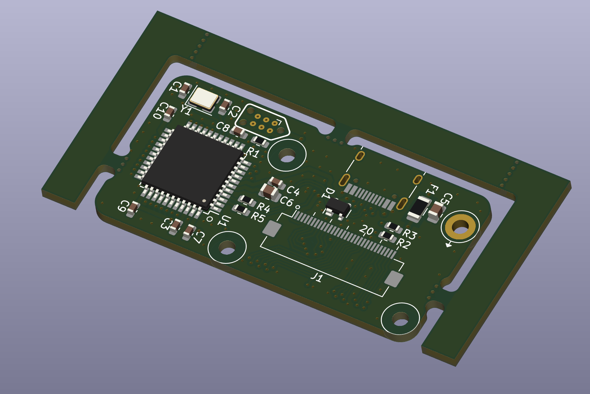
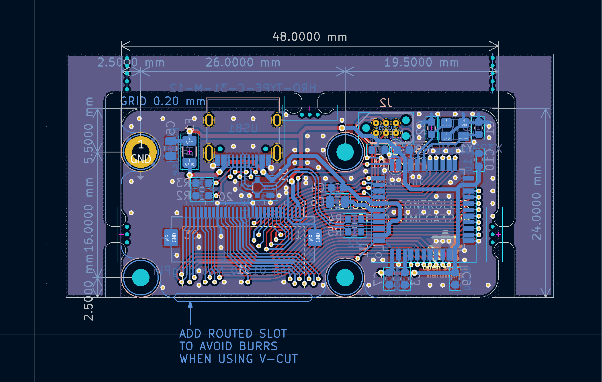
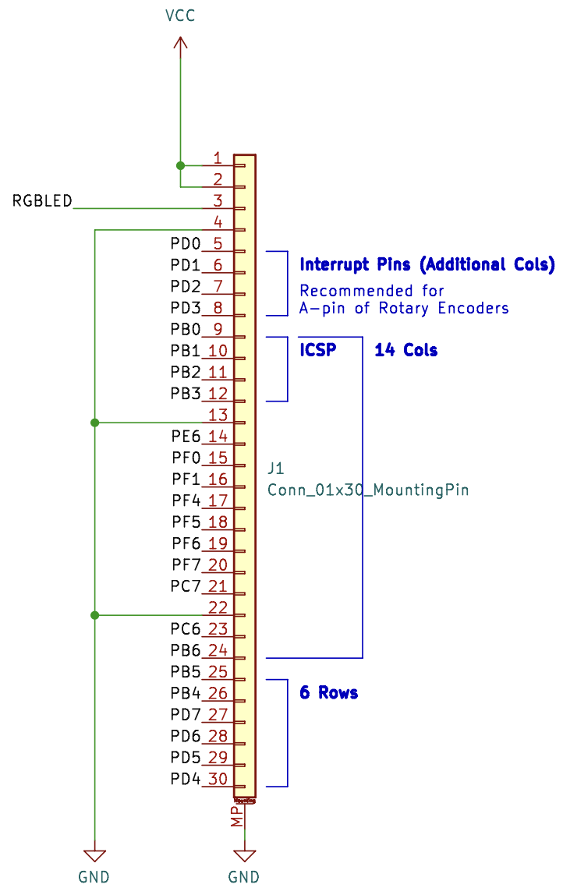

# keyboard-mcu-pcb

## About

A keyboard MCU PCB that can be connected with the key matrix PCB with a FFC cable. Designed for simplifying routing and removing MLC capacitors from the matrix PCB.

## Features

- Open Source.
- ESD protection diodes.
- Compatible with a 30 pins, 0.5 mm pitch FFC.

## Dimensions

- All holes are M2 clearance hole.
- All corner radii are 2.5 mm.
- PCB thickness is 1.6 mm.

## FFC Wiring

| pins               | usage                    |
|:-------------------|:-------------------------|
| 1-2                | Vcc                      |
| 3                  | RGBLED (PWM enabled pin) |
| 4                  | GND                      |
| 5-8                | Interrupt Pins           |
| 9-12, 14-21, 23-24 | 14 Cols                  |
| 25-30              | 6 Rows                   |

## License

MIT otherwise noted.
